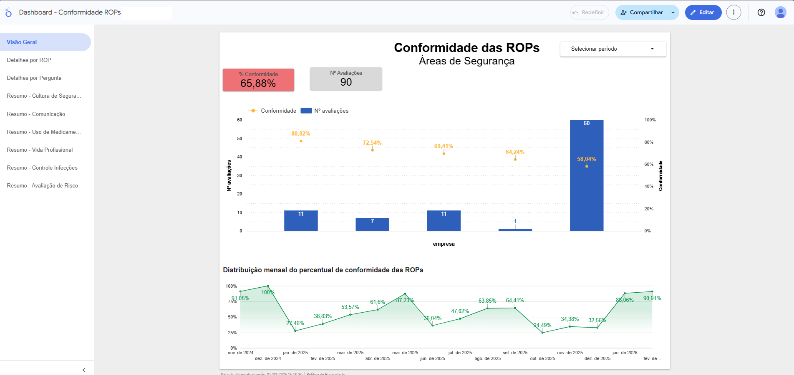

# 🏥 Pipeline de Dados de Auditoria (ETL/ELT)

Projeto de Engenharia de Dados focado na consolidação de múltiplas fontes de dados (Google Sheets) em uma visualização unificada no BigQuery para alimentação de dashboards gerenciais no Looker Studio.

## 🎯 Objetivo
Centralizar os dados de auditoria de conformidade de 5 unidades hospitalares diferentes. Cada unidade preenche seus dados em planilhas separadas no Google Sheets. O objetivo era criar um fluxo automatizado onde novas respostas na planilha refletissem automaticamente no Data Warehouse sem intervenção manual (upload de arquivos).



## 🛠️ Tecnologias Utilizadas
* **Google BigQuery:** Data Warehouse (Armazenamento e Processamento Serverless).
* **SQL (Standard SQL):** Linguagem para definição de estrutura (DDL) e manipulação (DML).
* **Google Sheets:** Fonte de dados (Input) e Automação de tratamento prévio.
* **Looker Studio:** Visualização de dados e Dashboards.

## ⚡ Desafios e Soluções (Estudo de Caso)

Durante o desenvolvimento, enfrentei desafios reais de arquitetura de dados e padronização. Abaixo detalho as soluções aplicadas:

### 1. Ingestão Automatizada (External Tables)
* **Problema:** O método tradicional de carregar arquivos CSV era manual e estático.
* **Solução:** Implementei **Tabelas Externas** via DDL (`CREATE EXTERNAL TABLE`). Isso criou uma conexão "viva" com o Google Drive. O BigQuery lê a planilha em tempo real a cada consulta, garantindo dados sempre frescos.

### 2. Padronização de Schema (Data Types)
* **Problema:** O BigQuery tentava "adivinhar" os tipos de dados (Auto-detect). Quando encontrava formatações inconsistentes ou erros humanos na coluna de Data (ex: texto em vez de data), a tabela quebrava.
* **Solução (Abordagem ELT):**
    * Forcei a leitura de todas as colunas como `STRING` na camada de ingestão para garantir que **nenhum dado fosse descartado** na entrada.
    * Tratei a tipagem correta (Casting) na camada de Transformação (View).

### 3. Tratamento de Formato de Data (Data Quality)
* **Problema:**  O Google Sheets permitia inconsistências na formatação de datas (algumas com hora, outras sem), o que gerava erros de conversão no BigQuery.
* **Solução:**
   * Apliquei um script em Google Apps Script que intercepta o dado bruto, padroniza a data para texto (`dd/MM/yyyy HH:mm:ss`) e escreve na aba de destino. Isso eliminou a necessidade de tratamentos complexos de exceção no SQL.
   * Já no BigQuery, utilizei a função `PARSE_TIMESTAMP` para converter o texto em objeto de data/hora válido.

```sql
-- Exemplo do tratamento aplicado na View
PARSE_TIMESTAMP('%d/%m/%Y %H:%M:%S', ID_da_Avaliacao) AS data_hora
```
### 4. Consolidação Multi-Tenant
* **Problema:** As planilhas eram idênticas, mas não possuíam uma coluna identificando a unidade hospitalar.
* **Solução:** Criei uma VIEW consolidada utilizando `UNION ALL`, injetando manualmente uma coluna de identificação (ex: `'HSLS' AS empresa`) em cada bloco de seleção.

## 🚀 Como está estruturado este repositório
1. `/sql/01_ingestao_external_tables.sql`: Contém os scripts DDL para criar as conexões com as 5 planilhas do Google Sheets.
2. `/sql/02_transformacao_view.sql`: Contém a query que une as 5 tabelas, converte os tipos de dados e gera a View final para consumo.

## 🌟 Lições Aprendidas: Qualidade na Fonte
Durante o projeto, houve um impasse onde o SQL falhava ao ler datas mal formatadas. Tentei criar lógicas complexas com `CASE WHEN` e `SAFE_CAST` para contornar o erro.

Porém, a lição mais valiosa foi perceber que garantir a qualidade na fonte é superior a tratar o erro no destino. Ao implementar um script de padronização na planilha de origem, tornei o pipeline de dados muito mais robusto e previsível.

  *"A Engenharia de Dados não é apenas sobre escrever código complexo para lidar com dados ruins, mas também sobre garantir a Governança e a Qualidade do Dado na fonte sempre que possível."*

Autor: Ediney Magalhães
